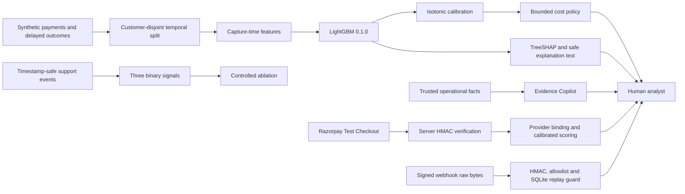

# Chargeback Radar

Chargeback Radar is a defense-only merchant risk manager that estimates 120-day card-payment chargeback risk, explains the estimate, and recommends a bounded response without executing a financial action.

Built for the **Razorpay AI Build Hackathon 2026 — Track 02: AI Risk Manager**.

> All evaluation data is synthetic. Reported performance does not establish real-world effectiveness. Razorpay integration is Test Mode only, and Test Mode payments never enter the held-out metrics.

## The merchant problem

A classifier can rank payment risk, but a merchant still needs a calibrated probability, an auditable reason for prioritization, a cost-aware response, and grounded evidence. Unnecessary intervention also creates review cost and customer friction. Chargeback Radar joins those decisions while leaving every consequential action with a human.

It goes beyond a classifier through:

- isotonic probability calibration and an explicit review-capacity policy;
- deterministic capture-time and post-payment rules;
- TreeSHAP explanations with additivity checks;
- safe analyst wording clearly separated from dispute evidence;
- timestamp-safe support-text signals and a controlled ablation;
- a grounded Evidence Copilot with exact fact citations and deterministic fallback;
- tamper-evident audit records;
- Razorpay Test Mode Checkout, server-side signature verification, verified-payment scoring, and signed idempotent webhooks.

The product never captures, refunds, files a dispute, contacts a customer, or submits evidence automatically.

## Architecture



The browser receives only the public Test key and sends the Checkout payment ID and signature to the backend. Server secrets, model artifacts, trusted facts, webhook verification, and SQLite stores remain on the backend. See [Architecture](docs/ARCHITECTURE.md) and [Security](docs/SECURITY.md).

## Data and evaluation design

The fixed-seed generator creates 80,000 synthetic payments. The exact target is `chargeback_within_120d`: whether a synthetic payment receives a chargeback inside the 120-day observation window.

| Partition | Period | Rows | Positives | Purpose |
|---|---|---:|---:|---|
| Train | Months 1–9 | 59,048 | 420 | Fit preprocessing and LightGBM |
| Calibration | Month 10 | 8,779 | 71 | Select and fit calibration |
| Held-out test | Months 11–12 | 12,173 | 87 | Final model and policy reporting |

Customers are disjoint across all three partitions. Only information observable at payment capture enters the model. Customer identity, final chargeback outcome, dispute state/reason, and future delivery or refund information are forbidden features. Post-payment rules operate separately at an explicit `as_of` time.

## Canonical held-out results

| Measure | Result |
|---|---:|
| Test base rate | 0.7147% |
| Calibrated Average Precision | 14.9264% |
| Calibrated Brier score | 0.006258 |
| Expected calibration error | 0.001502 |
| Precision | 19.466% |
| Recall | 58.621% |
| F1 | 0.292264 |
| Precision at 1% | 18.033% |
| Precision at 5% | 11.166% |

Precision-at-fraction metrics resolve equal calibrated probabilities with an outcome-blind deterministic BLAKE2b hash of the payment ID. This keeps isotonic-calibration ties reproducible across operating systems without adding identity to the model.

The fixed operating threshold is selected around a 2% review-capacity constraint. Deterministic merchant-error overrides can increase the full policy intervention rate beyond the model-only capacity. At the canonical model threshold, 51 chargebacks are flagged, 36 are missed, and 211 legitimate payments are false positives.

The synthetic cost policy assumes a ₹1,500 chargeback fee, ₹150 manual-review cost, ₹40 evidence cost, 8% customer-friction rate, 45% evidence recovery, 65% review prevention, 35% refund cost, and ₹800 risk-program penalty. Under those declared assumptions, detector false-positive cost is ₹31,650. Exposure and benefit values are backtest estimates—not realized savings or guarantees.

## Explanations, evidence, and support signals

Every held-out payment has a deterministic TreeSHAP record aligned to model version `0.1.0` and explanation version `shap-v1`. Risk-increasing and risk-decreasing contributions preserve feature values and ordering, and reconstruction error is effectively zero.

**Model explanation — not evidence.** SHAP factors describe contributions to the model estimate. They do not establish causation, fraud, customer intent, or dispute facts.

Evidence Copilot is a separate grounded workflow. It can use only supplied trusted facts, must cite exact fact IDs, preserves the deterministic recommended action, reports missing evidence, keeps customer messages draft-only, requires human approval, and returns `action_executed=false`. Optional OpenAI phrasing is guarded; disabling it or any provider failure selects the deterministic fallback.

Support processing exposes exactly three binary signals:

- `intent_to_cancel`
- `non_receipt_complaint`
- `dissatisfaction`

Only support events observable by the scoring timestamp are compiled. The pipeline removes PII, resists prompt injection, hashes safe inputs for caching, and never persists raw text in the signal report. It observed 8,270 events and excluded 5,297 future events.

The controlled enhanced-model ablation raised calibrated AP from 0.149264 to 0.152772 and recall from 58.621% to 63.218%. Precision decreased slightly from 19.466% to 19.366% (−0.099 percentage points); Brier score improved by about 0.000058. This synthetic experiment demonstrates methodology, not real-world generalization.

## Razorpay Test Mode

The primary demonstration flow is:

1. the backend creates an INR Test Mode order under a canonical idempotency key;
2. the frontend opens the official Razorpay Checkout script using the returned public Test key;
3. the backend verifies `HMAC-SHA256(server_order_id|payment_id)` in constant time before any provider fetch or scoring;
4. server-side order/payment lookup binds IDs, amount, INR currency, card method, and authorized/captured status;
5. the existing model, preprocessor, and isotonic calibrator score merchant-declared capture-time context;
6. the response keeps `human_approval_required=true`, `financial_action_executed=false`, and synthetic evaluation separate.

Webhook ingestion streams at most 1 MB of exact raw bytes, verifies its HMAC before JSON parsing, applies an eight-event allowlist, atomically rejects event-ID/content conflicts, returns idempotent replays, and stores only event ID, payload hash, type, status, and timestamps. A signed request was verified locally and through a temporary public HTTPS tunnel; a genuine provider-originated webhook delivery was not observed.

## Local setup

Prerequisites: Git, Python 3.12+ (the release was also verified on Python 3.14), Node.js 22+, npm, and PowerShell 7+ for the one-command gate.

```powershell
git clone https://github.com/Vaishnaviii002/chargeback-Radar.git
Set-Location chargeback-Radar
python -m venv .venv
.\.venv\Scripts\Activate.ps1
python -m pip install -r requirements.txt
npm --prefix frontend ci
Copy-Item .env.example .env
Copy-Item frontend/.env.example frontend/.env
```

Model binaries and generated data are intentionally ignored. If they are absent, reproduce the deterministic baseline first:

```powershell
.\.venv\Scripts\python.exe -m src.pipeline
```

Run the backend and frontend in separate PowerShell terminals:

```powershell
.\.venv\Scripts\python.exe -m uvicorn src.api:app --host 127.0.0.1 --port 8000
```

```powershell
npm --prefix frontend run dev -- --host 127.0.0.1
```

Open `http://127.0.0.1:5173`; API docs are at `http://127.0.0.1:8000/docs`.

## Environment variables

Start from `.env.example`; its secret values are intentionally blank.

| Group | Variables |
|---|---|
| Optional OpenAI | `OPENAI_API_KEY`, `OPENAI_MODEL`, `OPENAI_TIMEOUT_SECONDS`, `OPENAI_MAX_RETRIES` |
| AI feature switches | `EVIDENCE_AI_ENABLED`, `MODEL_EXPLANATION_AI_ENABLED`, `SUPPORT_SIGNAL_AI_ENABLED` |
| Evidence/runtime | `EVIDENCE_CACHE_DIR`, `EVIDENCE_CACHE_TTL_SECONDS`, `EVIDENCE_FALLBACK_CACHE_TTL_SECONDS`, `EVIDENCE_AUDIT_PATH`, `EVIDENCE_AUDIT_HMAC_KEY` |
| Support/runtime | `SUPPORT_SIGNAL_CACHE_DIR`, `SUPPORT_SIGNAL_CACHE_TTL_SECONDS`, `SUPPORT_SIGNAL_FALLBACK_CACHE_TTL_SECONDS` |
| Razorpay server | `RAZORPAY_INTEGRATION_ENABLED`, `RAZORPAY_TEST_MODE`, `RAZORPAY_KEY_ID`, `RAZORPAY_KEY_SECRET`, `RAZORPAY_TIMEOUT_SECONDS`, `RAZORPAY_DATABASE_PATH`, `RAZORPAY_WEBHOOK_ENABLED`, `RAZORPAY_WEBHOOK_SECRET` |
| Backend CORS | `BACKEND_ALLOWED_ORIGINS` (comma-separated exact origins; no wildcard) |
| Frontend build | `VITE_API_URL` (public backend URL only) |

Never put `RAZORPAY_KEY_SECRET`, `RAZORPAY_WEBHOOK_SECRET`, an audit HMAC key, or an OpenAI key in `frontend/.env` or any `VITE_` variable. `RAZORPAY_TEST_MODE=false` is rejected.

Set `RAZORPAY_DATABASE_PATH` to a writable persistent-volume location for a single-instance deployment. Existing pre-versioned cached scores replay with `calibration_version=legacy-unrecorded`; their stored probability and decision are never recomputed or rewritten.

## Verification and regeneration

Run the complete, offline-safe release gate:

```powershell
.\scripts\verify_release.ps1
```

It validates report identity, held-out alignment, SHAP additivity and ordering, support-signal safety, ablation/model-card consistency, OpenAPI uniqueness, intended routes, ignore rules, credential/tunnel hygiene, all backend tests, frontend lint and the production build, and Git whitespace. It forces optional external integrations off and requires no real secret.

Individual commands:

```powershell
.\.venv\Scripts\python.exe -m pytest -q
npm --prefix frontend run build
git diff --check
```

Full deterministic report regeneration:

```powershell
.\.venv\Scripts\python.exe -m src.pipeline
```

This single command rebuilds synthetic data, features, disjoint splits, model, calibration, held-out reports, policies, SHAP and deterministic explanation text, support events/signals, controlled ablation, deterministic evidence guardrails, the model card, and the submission manifest. It forces optional AI and Razorpay network integrations off, uses isolated temporary caches, and applies a stable build timestamp for canonical reports.

See [Reproducibility](docs/REPRODUCIBILITY.md) for expected identities and acceptable third-party warnings. CI performs the complete rebuild and the same release gate without external API or financial calls.

## Deployment

The root `Dockerfile` creates a non-root production backend image, regenerates required ignored model/data artifacts during the image build, disables optional integrations by default, starts Uvicorn without reload, and includes an `/api/health` health check. Build and run locally:

```powershell
docker build -t chargeback-radar-api .
docker run --rm -p 8000:8000 chargeback-radar-api
```

Deploy `frontend/dist` to a static host after setting `VITE_API_URL` at build time, and set `BACKEND_ALLOWED_ORIGINS` to that exact HTTPS origin. Add optional secrets only through the provider’s secret manager. Detailed steps are in [Reproducibility](docs/REPRODUCIBILITY.md) and [Security](docs/SECURITY.md).

- Stable backend URL: **Not deployed yet**
- Stable frontend URL: **Not deployed yet**
- Demo video URL: **Not recorded yet (Phase 10)**

No temporary tunnel is production hosting.

## Repository map

```text
src/                     model, policy, explanation, evidence and API code
frontend/                React/TypeScript/Vite dashboard
artifacts/               tracked schemas/metadata; ignored generated models
reports/                 canonical synthetic evaluation and governance reports
tests/                   backend, leakage, governance and Razorpay tests
scripts/                 one-command release verification
docs/                    architecture, security, reproducibility and demo runbook
.github/workflows/       offline-safe CI
Dockerfile               production backend image
SUBMISSION_READINESS.md  verified release summary and Phase 10 handoff
```

## Known limitations

- All model and policy evaluation uses synthetic data; it cannot establish production effectiveness or realized savings.
- The enhanced support-signal model has slightly lower precision despite improved AP, recall, and Brier score.
- SHAP is descriptive of model behavior, not causal and not dispute evidence.
- Razorpay is Test Mode only. Test Mode results are excluded from held-out metrics.
- No genuine Razorpay provider webhook delivery was observed; only signed local and tunneled requests were verified.
- Optional OpenAI use changes wording/extraction delivery, not authority; deterministic fallback remains the safe default.
- The Docker configuration was statically reviewed, but its image build and runtime health check were not verified locally because the Docker daemon was unavailable. No stable hosted URL is claimed until external authentication and deployment are completed.
- Automated browser smoke and visual QA were not run because no in-app browser target was available; the production frontend build and API health check were verified locally.

## Five-minute judge path

1. Open the dashboard and state the synthetic-data and defense-only boundaries.
2. Show held-out AP, calibration, precision/recall, and the cost-policy assumptions.
3. Open a high-risk held-out case and show **Model explanation — not evidence**.
4. Generate grounded Evidence Copilot output, point to exact fact citations, and show human approval plus `action_executed=false`.
5. Explain the three timestamp-safe support signals and the honest precision/recall ablation trade-off.
6. Complete a Razorpay Test Mode Checkout, show server verification and calibrated scoring, then show webhook signature/replay handling.

Use the exact recording sequence and stop commands in [Demo Runbook](docs/DEMO_RUNBOOK.md).
